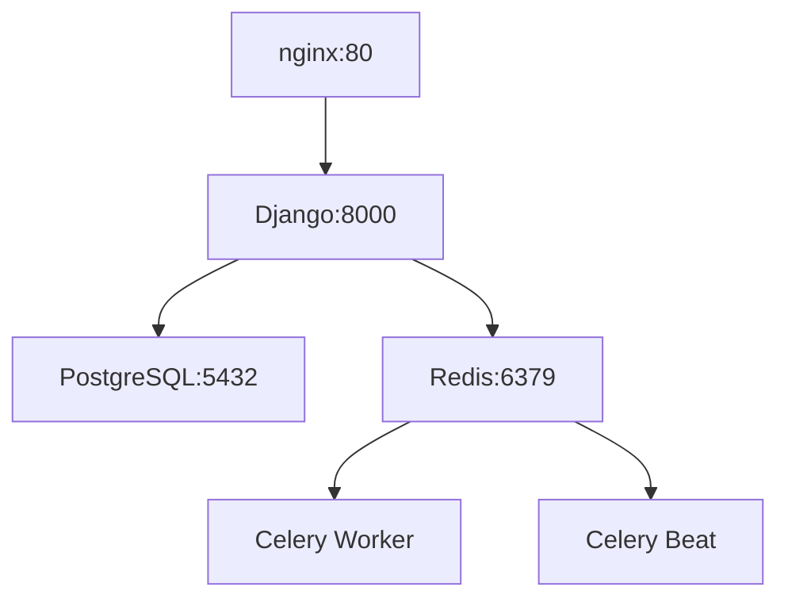

# 🎯 Habits API Tracker

**Habits API Tracker** — это полнофункциональное бэкенд-приложение для отслеживания привычек, созданное с использованием Django и Django Rest Framework. Проект основан на принципах книги Джеймса Клира «Атомные привычки» и полностью контейнеризирован с настроенным CI/CD процессом.

## ✨ Основные функции

- 🔐 **Авторизация и аутентификация** пользователей с помощью JWT-токенов
- 📝 **CRUD операции** для управления привычками
- 👥 **Публичные и приватные привычки** с разграничением доступа
- 🔗 **Связывание привычек** для создания системы вознаграждений
- 📱 **Telegram уведомления** через Celery для напоминаний
- 🐳 **Полная контейнеризация** с Docker и Docker Compose
- 🚀 **CI/CD процесс** с автоматическим тестированием и деплоем
- 🌐 **Production-ready** конфигурация с nginx

## 🛠️ Технологический стек

### Backend
- **Python 3.12**
- **Django 5.1** + **Django Rest Framework**
- **drf-spectacular** для генерации OpenAPI/Swagger документации
- **Django Simple JWT** для аутентификации
- **PostgreSQL** как основная база данных

### Асинхронные задачи
- **Celery** для обработки фоновых задач
- **Redis** как брокер сообщений и кэш

### DevOps & Deployment
- **Docker** + **Docker Compose** для контейнеризации
- **GitHub Actions** для CI/CD
- **nginx** как reverse proxy и для статических файлов
- **Multi-stage Dockerfile** для оптимизации образов

---

### Установка и запуск

### Локальный запуск через Docker (рекомендуемый)

1.  **Клонирование репозитория:**
    ```bash
    git clone https://github.com/Doczadrot/Tracker_habits.git
    cd Tracker_habits
    ```

2. **Настройка переменных окружения:**
   ```bash
   cp env.example .env
   ```
   
   Отредактируйте `.env` файл:
   ```env
   SECRET_KEY=your-secret-key-here
   DEBUG=True
   DATABASE_NAME=habits_db
   DATABASE_USER=habits_user
   DATABASE_PASSWORD=your-password
   DATABASE_HOST=db
   DATABASE_PORT=5432
   CELERY_BROKER_URL=redis://redis:6379/0
   CELERY_RESULT_BACKEND=redis://redis:6379/0
   ALLOWED_HOSTS=localhost,127.0.0.1
   TELEGRAM_BOT_TOKEN=your-telegram-bot-token
   ```

3. **Запуск всех сервисов:**
   ```bash
   docker-compose up -d --build
   ```

4. **Инициализация приложения:**
   ```bash
   docker-compose exec web python manage.py migrate
   docker-compose exec web python manage.py createsuperuser
   docker-compose exec web python manage.py collectstatic --noinput
   ```

5. **Проверка работы:**
   - 🌐 **API**: http://localhost/api/
   - 📚 **Swagger документация**: http://localhost/api/schema/swagger/
   - ⚙️ **Django Admin**: http://localhost/admin/
   - ❤️ **Health Check**: http://localhost/health/

### 🛠️ Управление контейнерами

```bash
# Остановка всех сервисов
docker-compose down

# Остановка с удалением данных 
docker-compose down -v

# Просмотр логов
docker-compose logs -f web
docker-compose logs -f celery_worker
docker-compose logs -f nginx

# Перезапуск конкретного сервиса
docker-compose restart web

# Проверка статуса всех сервисов
docker-compose ps
```

## Локальный запуск без Docker

1.  **Создание и активация виртуального окружения:**
    ```bash
    python -m venv .venv
    source .venv/bin/activate  # Linux/Mac
    # или
    .venv\Scripts\activate     # Windows
    ```

2.  **Установка зависимостей:**
    ```bash
    pip install -r requirements.txt
    ```

3.  **Настройка окружения:**
    Создайте файл `.env` и настройте переменные для локальной разработки.

4.  **Настройка базы данных:**
    Убедитесь, что у вас установлен и запущен **PostgreSQL**. Затем примените миграции:
    ```bash
    python manage.py migrate
    ```

5.  **Создание суперпользователя:**
    ```bash
    python manage.py createsuperuser
    ```

6.  **Запуск Redis и Celery:**
    В отдельных терминалах:
    ```bash
    # Terminal 1 - Redis
    redis-server
    
    # Terminal 2 - Celery Worker  
    celery -A config worker --loglevel=info
    
    # Terminal 3 - Celery Beat
    celery -A config beat -l info
    ```

7.  **Запуск сервера:**
    ```bash
    python manage.py runserver
    ```

---

## Настройка сервера для продакшн

## 🌐 Production деплой

### Архитектура сервисов



### Автоматический деплой

Проект настроен для автоматического деплоя через **GitHub Actions**:

1. **Push в main ветку** → Автоматический запуск CI/CD
2. **Тестирование** (pytest + линтинг)  
3. **Сборка Docker образов**
4. **Деплой на production сервер**

### Ручная настройка сервера

**Требования к серверу:**
- Ubuntu 20.04+ 
- 1GB RAM, 25GB SSD (минимум)
- Открытые порты: 22, 80, 443

**Быстрая настройка:**
```bash
# Автоматическая настройка сервера
curl -fsSL https://raw.githubusercontent.com/Doczadrot/Tracker_habits/main/scripts/server-setup.sh | sudo bash

# Клонирование проекта
sudo su - deploy
cd /opt/habits-api
git clone https://github.com/Doczadrot/Tracker_habits.git .

# Настройка окружения
cp env.example .env
nano .env  # Настройте production переменные

# Запуск production
docker-compose -f docker-compose.prod.yml up -d --build
docker-compose -f docker-compose.prod.yml exec web python manage.py migrate
docker-compose -f docker-compose.prod.yml exec web python manage.py createsuperuser
```

### Мониторинг и логи

```bash
# Просмотр статуса контейнеров
docker-compose -f docker-compose.prod.yml ps

# Просмотр логов
docker-compose -f docker-compose.prod.yml logs -f web
docker-compose -f docker-compose.prod.yml logs -f celery_worker
docker-compose -f docker-compose.prod.yml logs -f nginx

# Перезапуск сервисов
docker-compose -f docker-compose.prod.yml restart web
```

---

---

## ⚙️ CI/CD с GitHub Actions

### Pipeline структура

```yaml
# .github/workflows/ci-cd.yml
jobs:
  test:     
  lint:      #
  docker:    
  deploy:  
```

### Настройка GitHub Secrets

**Settings → Secrets and variables → Actions:**

| Secret | Значение | Описание |
|--------|----------|----------|
| `SERVER_HOST` | `212.233.79.64` | IP адрес сервера |
| `SERVER_USER` | `deploy` | Пользователь для SSH |
| `SERVER_SSH_KEY` | `-----BEGIN OPENSSH...` | Приватный SSH ключ |

### Процесс деплоя

1. **Push в main** → Запуск pipeline
2. **Тесты проходят** → Сборка Docker образов  
3. **Образы готовы** → Деплой на production
4. **Автоматическое обновление** сервиса

```bash
# Простой деплой
git add .
git commit -m "Update feature"
git push origin main
# GitHub Actions сделает всё остальное!
```

---

## 📚 API Документация

### Swagger UI
- **Локально**: http://localhost/api/schema/swagger/
- **Production**: http://212.233.79.64/api/schema/swagger/

### Основные эндпоинты

| Метод | URL | Описание | Авторизация |
|-------|-----|----------|-------------|
| `POST` | `/users/register/` | Регистрация пользователя | ❌ |
| `POST` | `/users/login/` | Получение JWT токенов | ❌ |
| `GET` | `/habits/` | Список своих привычек | ✅ |
| `POST` | `/habits/new/` | Создание привычки | ✅ |
| `GET` | `/habits/{id}/` | Детали привычки | ✅ |
| `PUT` | `/habits/{id}/update/` | Обновление привычки | ✅ |
| `DELETE` | `/habits/{id}/delete/` | Удаление привычки | ✅ |
| `GET` | `/public-habits/` | Публичные привычки | ❌ |
| `GET` | `/health/` | Health check | ❌ |

### Аутентификация
```bash
# Получение токена
curl -X POST http://localhost/users/login/ \
  -H "Content-Type: application/json" \
  -d '{"email": "user@example.com", "password": "password"}'

# Использование токена
curl -X GET http://localhost/habits/ \
  -H "Authorization: Bearer YOUR_ACCESS_TOKEN"
```

---

## 🏗️ Архитектура проекта

```
TRACKER/
├── 🐳 Docker & CI/CD
│   ├── Dockerfile                 # Multi-stage build
│   ├── docker-compose.yml         # Development
│   ├── docker-compose.prod.yml    # Production  
│   └── .github/workflows/         # GitHub Actions
│
├── 🌐 Web сервер
│   └── nginx/                     # Reverse proxy конфиги
│
├── 📱 Django приложения  
│   ├── habits/                    # Логика привычек
│   ├── users/                     # Пользователи и авторизация
│   └── config/                    # Настройки проекта
│
├── 🛠️ DevOps скрипты
│   └── scripts/                   # Автоматизация деплоя
│
└── 📖 Документация
    └── docs/                      # Roadmap и документы
```

---

## 👨‍💻 Автор

**Иван** - Full Stack Developer

- 🔗 **Репозиторий**: [Tracker_habits](https://github.com/Doczadrot/Tracker_habits)
- 📧 **Email**: your-email@example.com

---

## 📄 Лицензия

Этот проект распространяется под лицензией MIT. Подробности в файле [LICENSE](LICENSE).
